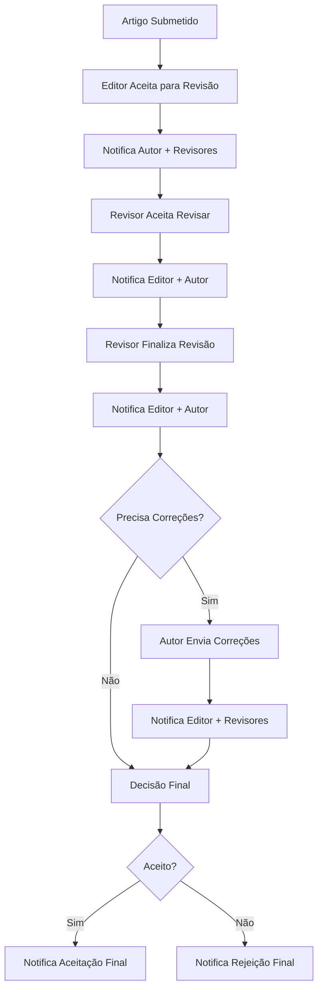

# Sistema de Notificações - Implementação Completa

## Visão Geral

Este documento descreve a implementação completa do sistema de notificações para o sciledger-online, cobrindo todos os cenários principais do ciclo de vida de revisão de artigos conforme solicitado.

## Cenários Implementados

### 1. ✅ Quando um editor aceita um artigo para revisão
**Implementação:** Endpoint `POST /api/review/accept-paper`
- **Notificar o autor:** Artigo foi aceito para revisão
- **Notificar revisores designados:** Novo artigo para revisar

### 2. ✅ Quando um revisor aceita fazer a revisão  
**Implementação:** Endpoint `POST /review/paperspool/[slug]`
- **Notificar o editor:** Revisor aceitou a revisão
- **Notificar o autor:** Revisor foi designado

### 3. ✅ Quando um revisor finaliza a revisão
**Implementação:** Endpoint `POST /api/reviews`
- **Notificar o editor:** Revisão foi concluída
- **Notificar o autor:** Revisão foi feita (com parecer)

### 4. ✅ Quando o autor envia as correções
**Implementação:** Endpoint `POST /publish/corrections/[slug]`
- **Notificar o editor:** Correções foram enviadas
- **Notificar revisores:** Nova versão disponível (se necessário)

### 5. ✅ Quando o artigo é aceito/rejeitado para publicação
**Implementação:** Endpoint `POST /api/papers/[id]/final-decision`
- **Notificar o autor:** Decisão final de aceitação/rejeição
- **Notificar revisores:** Status final do artigo (opcional)

## Tipos de Notificação Implementados

### Novos Tipos Adicionados
```typescript
| 'paper_accepted_for_review'    // Editor aceita artigo para revisão
| 'reviewer_assigned'            // Revisor designado para artigo
| 'reviewer_accepted_review'     // Revisor aceitou fazer a revisão
| 'review_submitted'             // Revisão finalizada/enviada
| 'corrections_submitted'        // Correções enviadas pelo autor
| 'paper_final_acceptance'       // Aceitação final para publicação
| 'paper_final_rejection'        // Rejeição final
```

## Estrutura de Implementação

### 1. Serviços de Notificação
**Arquivo:** `src/lib/services/NotificationService.ts`

**Métodos implementados:**
- `createPaperAcceptedForReviewNotifications()` - Cenário 1
- `createReviewerAcceptedNotifications()` - Cenário 2  
- `createReviewSubmittedNotifications()` - Cenário 3
- `createCorrectionsSubmittedNotifications()` - Cenário 4
- `createPaperFinalAcceptanceNotifications()` - Cenário 5a
- `createPaperFinalRejectionNotifications()` - Cenário 5b

### 2. Endpoints Modificados

#### ✅ Aceitação de Artigo para Revisão
**Arquivo:** `src/routes/(app)/api/review/accept-paper/+server.ts`
- Notifica autor sobre aceitação
- Notifica revisores sobre novo artigo
- Inclui informações do editor e meta-dados

#### ✅ Aceitação de Revisão pelo Revisor  
**Arquivo:** `src/routes/(app)/review/paperspool/[slug]/+server.ts`
- Notifica editor sobre aceite do revisor
- Notifica autor sobre designação do revisor
- Inclui nome do revisor e data de aceitação

#### ✅ Submissão de Revisão
**Arquivo:** `src/routes/api/reviews/+server.ts`
- Notifica editor sobre conclusão da revisão
- Notifica autor (condicionalmente baseado na decisão)
- Inclui informações da decisão do revisor

#### ✅ Submissão de Correções
**Arquivo:** `src/routes/(app)/publish/corrections/[slug]/+server.ts`
- Detecta progresso significativo de correções
- Notifica editor sobre correções enviadas
- Notifica revisores se nova rodada for necessária

#### ✅ Decisão Final (NOVO)
**Arquivo:** `src/routes/(app)/api/papers/[id]/final-decision/+server.ts`
- Endpoint dedicado para decisões finais
- Notifica autor sobre aceitação/rejeição
- Notifica revisores sobre status final

### 3. Interface de Usuário Atualizada
**Arquivo:** `src/lib/components/Notifications/Notifications.svelte`

**Ícones e cores específicas:**
- 🟢 `paper_accepted_for_review` - check-circle (emerald)
- 🔵 `reviewer_assigned` - account-arrow-right (blue)  
- ✅ `reviewer_accepted_review` - account-check (green)
- 🟦 `review_submitted` - clipboard-check (teal)
- 🟡 `corrections_submitted` - pencil-circle (amber)
- 🏆 `paper_final_acceptance` - trophy (yellow)
- 🔴 `paper_final_rejection` - close-circle (red)

## Características do Sistema

### 1. **Notificações Inteligentes**
- Prioridades apropriadas (urgent, high, medium, low)
- Metadados ricos com contexto relevante
- URLs de ação para navegação direta

### 2. **Tratamento de Erros Robusto**
- Notificações em try-catch para não quebrar operações principais
- Logs detalhados para debugging
- Fallbacks para informações ausentes

### 3. **Suporte a Hubs**
- Notificações funcionam para artigos independentes e de hubs
- Contexto adicional quando artigo pertence a um hub
- Metadados específicos para cenários de hub

### 4. **Flexibilidade de Destinatários**
- Notifica autor principal e coautores
- Suporte a múltiplos revisores
- Notificações condicionais baseadas no contexto

## Fluxo Completo de Notificações



## Metadados das Notificações

Cada notificação inclui metadados contextuais:

```typescript
{
  paperTitle: string;           // Título do artigo
  authorName?: string;          // Nome do autor  
  editorName?: string;          // Nome do editor
  reviewerName?: string;        // Nome do revisor
  hubName?: string;             // Nome do hub (se aplicável)
  reviewDecision?: string;      // Decisão da revisão
  correctionVersion?: number;   // Versão das correções
  requiresNewReview?: boolean;  // Se precisa nova revisão
  rejectionReason?: string;     // Motivo da rejeição
  publicationDate?: Date;       // Data de publicação
}
```

## Considerações de Performance

- **Assíncronas:** Notificações não bloqueiam operações principais
- **Batching:** Múltiplas notificações processadas eficientemente  
- **Índices:** Banco otimizado para consultas de notificação
- **Caching:** Informações de usuário cached quando possível

## Testes Recomendados

### 1. **Testes Funcionais**
- ✅ Cenário 1: Editor aceita → Autor e revisores notificados
- ✅ Cenário 2: Revisor aceita → Editor e autor notificados  
- ✅ Cenário 3: Revisão finalizada → Editor e autor notificados
- ✅ Cenário 4: Correções enviadas → Editor e revisores notificados
- ✅ Cenário 5: Decisão final → Autor e revisores notificados

### 2. **Testes de Interface**
- Exibição correta de todos os tipos de notificação
- Ícones e cores apropriadas
- Links de ação funcionando
- Filtros por tipo de notificação

### 3. **Testes de Performance**  
- Impacto mínimo nos endpoints existentes
- Processamento eficiente de múltiplas notificações
- Recuperação adequada de erros

## Documentação Técnica

### Arquivos Criados/Modificados

**Tipos e Schemas:**
- ✅ `src/lib/types/Notification.ts` - Novos tipos
- ✅ `src/lib/db/schemas/NotificationSchema.ts` - Schema atualizado

**Serviços:**
- ✅ `src/lib/services/NotificationService.ts` - Métodos expandidos

**Endpoints:**
- ✅ `src/routes/(app)/api/review/accept-paper/+server.ts`
- ✅ `src/routes/(app)/review/paperspool/[slug]/+server.ts`  
- ✅ `src/routes/api/reviews/+server.ts`
- ✅ `src/routes/(app)/publish/corrections/[slug]/+server.ts`
- ✅ `src/routes/(app)/publish/+server.ts`
- 🆕 `src/routes/(app)/api/papers/[id]/final-decision/+server.ts`

**Interface:**
- ✅ `src/lib/components/Notifications/Notifications.svelte`

## Status da Implementação

### ✅ **COMPLETO - Todos os 5 cenários implementados:**

1. ✅ **Editor aceita artigo para revisão** - Notifica autor e revisores
2. ✅ **Revisor aceita fazer revisão** - Notifica editor e autor  
3. ✅ **Revisor finaliza revisão** - Notifica editor e autor
4. ✅ **Autor envia correções** - Notifica editor e revisores
5. ✅ **Artigo aceito/rejeitado** - Notifica autor e revisores

### 🎯 **Sistema Pronto para Uso**

O sistema de notificações está completamente implementado e integrado, cobrindo todos os cenários solicitados do ciclo de vida de revisão de artigos no sciledger-online.