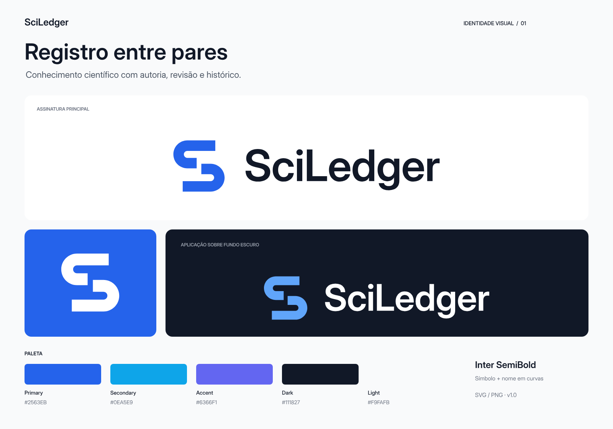

# SciLedger — kit de identidade visual

Kit da **proposta 01**, regenerado a partir do script original da entrega de 11/09/2026 às 10h04 (Brasília). Local atual: `brand/proposta-01/`. A geometria vetorial, a tipografia Inter e as variantes foram recuperadas do histórico. A prancha em `concepts/` é a exploração inicial; os arquivos em `logo/` e `png/` são o acabamento vetorial final dessa direção.

**Registro entre pares**: duas formas abertas sugerem um S e a continuidade de um registro científico construído por diferentes participantes. A direção foi escolhida após auditoria do repositório e comparação de cinco conceitos.



## Abrir primeiro

- [Logo principal SVG](logo/sciledger-logo.svg) e [PNG de 2400 px](png/sciledger-logo.png).
- [Guia da marca](brand-guidelines.md): conceito, significado, HEX/RGB, tipografia, versões, proteção, tamanhos e usos.
- [Auditoria e cinco conceitos](audit-and-concepts.md): fontes locais, limites de evidência, comparação e escolha.
- [Prancha de conceitos](concepts/sciledger-concepts-imagegen.png): exploração com ImageGen integrado.
- [Provas de aplicação](previews/sciledger-application-checks.png) e [variantes e mínimos](previews/sciledger-variants.png).
- [Scope check](scope-check.md): nenhuma alteração funcional ou aplicação dos assets ao produto.

## Conteúdo

O kit inclui 14 SVGs de marca, 19 PNGs de uso, 3 pranchas finais em SVG e PNG, 1 prancha conceitual raster, 2 prompts, 1 fonte e sua licença, documentação, scripts e relatórios de validação.

`-dark` significa uso **sobre fundo escuro**; `-light`, uso sobre fundo claro. Os PNGs da marca são transparentes; o favicon possui campo azul intencional. O arquivo sem sufixo e a versão `-light` são equivalentes.

## Lista completa de arquivos

```text
brand/
├── README.md
├── audit-and-concepts.md
├── brand-guidelines.md
├── scope-check.md
├── concepts/
│   ├── imagegen-prompt.txt
│   ├── imagegen-refinement-prompt.txt
│   └── sciledger-concepts-imagegen.png
├── fonts/
│   ├── InterVariable.ttf
│   └── OFL.txt
├── logo/
│   ├── sciledger-logo.svg
│   ├── sciledger-logo-light.svg
│   ├── sciledger-logo-dark.svg
│   ├── sciledger-logo-monochrome.svg
│   ├── sciledger-logo-white.svg
│   ├── sciledger-symbol.svg
│   ├── sciledger-symbol-dark.svg
│   ├── sciledger-symbol-monochrome.svg
│   ├── sciledger-symbol-white.svg
│   ├── sciledger-wordmark.svg
│   ├── sciledger-wordmark-white.svg
│   ├── sciledger-compact.svg
│   ├── sciledger-compact-dark.svg
│   └── sciledger-favicon.svg
├── png/
│   ├── sciledger-logo.png
│   ├── sciledger-logo-light.png
│   ├── sciledger-logo-dark.png
│   ├── sciledger-logo-monochrome.png
│   ├── sciledger-logo-white.png
│   ├── sciledger-symbol.png
│   ├── sciledger-symbol-dark.png
│   ├── sciledger-symbol-monochrome.png
│   ├── sciledger-symbol-white.png
│   ├── sciledger-wordmark.png
│   ├── sciledger-wordmark-white.png
│   ├── sciledger-compact.png
│   ├── sciledger-compact-dark.png
│   ├── sciledger-favicon.png
│   ├── sciledger-favicon-16.png
│   ├── sciledger-favicon-24.png
│   ├── sciledger-favicon-32.png
│   ├── sciledger-favicon-48.png
│   └── sciledger-favicon-64.png
├── previews/
│   ├── sciledger-brand-board.svg
│   ├── sciledger-brand-board.png
│   ├── sciledger-application-checks.svg
│   ├── sciledger-application-checks.png
│   ├── sciledger-variants.svg
│   └── sciledger-variants.png
└── source/
    ├── build-brand.mjs
    ├── check-assets.py
    ├── validation.json
    └── quality-check.json
```

## Produção e verificação

Os SVGs são masters vetoriais verdadeiros, com símbolo e tipografia em curvas. A fonte incluída é Inter Variable 4.001; a assinatura usa peso 600 e optical size 32. Origem: [Inter oficial](https://rsms.me/inter/), com a licença incluída sem alteração. A versão final é o redesenho geométrico da direção escolhida; não é uma vetorização automática da prancha raster.

O [prompt inicial](concepts/imagegen-prompt.txt) e o [prompt de refinamento](concepts/imagegen-refinement-prompt.txt) registram as chamadas à ferramenta integrada ImageGen. Não houve uso de CLI/API de geração. A imagem conceitual é evidência do processo, não um asset de aplicação.

Para reproduzir os assets, na raiz do repositório:

```sh
node brand/proposta-01/source/build-brand.mjs
python brand/proposta-01/source/check-assets.py
```

O primeiro comando usa fontkit e Playwright já disponíveis no repositório e requer Chromium instalado. O segundo usa Python com Pillow; nesta entrega foi executado com o runtime Python disponibilizado no ambiente. Nenhum deles inicia o app ou acessa serviços externos. Ambos escrevem apenas dentro de `brand/`.

Validação concluída: 17 SVGs parseados e renderizados, incluindo as três pranchas; 14 SVGs de uso conferidos como autocontidos; 19 PNGs de uso conferidos em RGBA, dimensões, transparência e paleta. Provas visuais a 16–64 px para favicon, 24–64 px para símbolo e mínimos de 160 px horizontal, 110 px wordmark e 140 px compacta. As três pranchas finais foram inspecionadas.

Esta regeneração salva o kit em `brand/proposta-01/`. A auditoria, o guia e o scope check documentam a entrega original. Os relatórios em `source/` foram gerados novamente sobre os arquivos deste kit.
