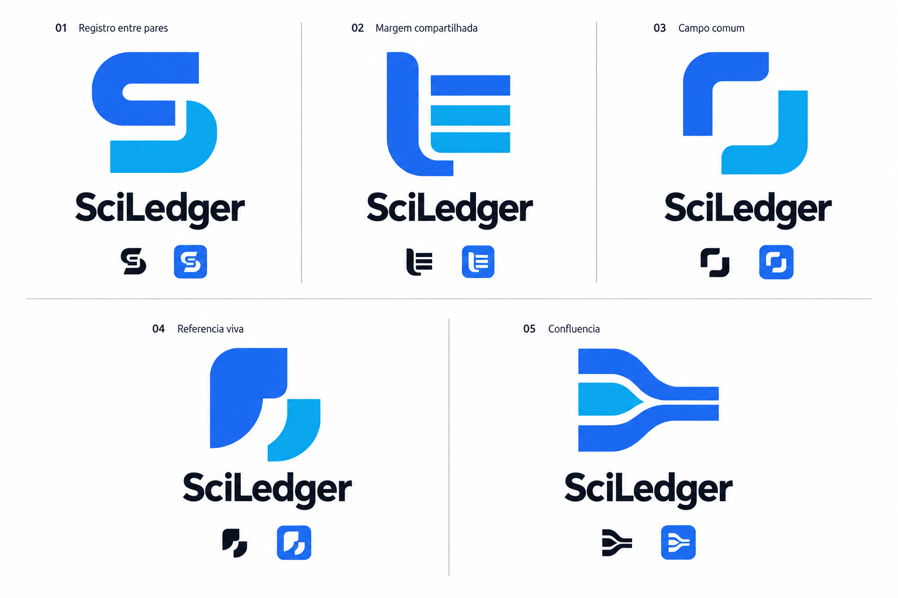

# SciLedger — auditoria e decisões de identidade

11 de setembro de 2026 · Auditoria local para branding, anterior à criação visual.

## Conclusão

O produto se organiza em publicação, revisão e Hubs. A marca precisa transmitir credibilidade editorial, colaboração entre pesquisadores e continuidade de um registro científico. A base azul existente é aproveitável; o átomo usado atualmente não distingue a plataforma e conflita com o briefing. A direção escolhida é **Registro entre pares**, finalizada em duas formas abertas que sugerem um S.

Fatos do projeto e interpretações de design são separados abaixo. Esta auditoria não valida promessas comerciais da landing nem certifica funcionalidades em produção.

## Evidências e implicações

| Fonte local | O que foi encontrado | Implicação para a marca |
| --- | --- | --- |
| [README](../README.md) | Plataforma em desenvolvimento para publicação científica, revisão por pares e colaboração acadêmica. | Comunicação científica é o núcleo verificável; não criar um posicionamento financeiro. |
| [package.json](../package.json) | SvelteKit, Svelte, TypeScript, Skeleton, Tailwind, MongoDB/Mongoose, ferramentas de documentos, ORCID via código e Stripe. | A marca será usada em software real, interfaces densas e documentos. O stack é implementação. |
| [app.css](../src/app.css) e [sciLedger.css](../src/sciLedger.css) | Tailwind v4, Skeleton e tema próprio importado. Azul primary, ciano secondary, índigo tertiary; cores separadas de sucesso, erro e alerta; `system-ui`; variantes dark. | Preservar a família cromática; diferenciar identidade e cores funcionais. |
| [sciLedger.ts](../src/sciLedger.ts) | Configuração de formato legado com heading Inter, azuis RGB explícitos e cantos distintos do CSS ativo. | Inter tem precedente real; o arquivo não foi tratado como tema ativo. Os valores RGB fornecem uma base para a padronização de exports. |
| [Layout principal](../src/routes/(app)/+layout.svelte) | AppBar, nome SciLedger em texto, navegação Publish / Review / Hub; Help, Policies, RBAC condicional; alternância claro/escuro. | Assinatura horizontal curta, alto contraste e símbolo adequado a espaços pequenos. |
| [Landing](../src/routes/landing/+page.svelte) | Favicon ampliado no hero; tipografia sem serifa; azuis; publicação, colaboração, revisão, transparência e remuneração de revisores. | Continuidade de tom e cor; não transformar blockchain em aparência de criptomoeda. |
| [Página inicial](../src/routes/(app)/+page.svelte) | Diretório público de Hubs e artigos publicados; cartões, superfícies neutras e destaques azul/ciano. | A plataforma é uma infraestrutura que acomoda identidades de comunidades. |
| [PublishPage](../src/lib/Pages/Publish/PublishPage.svelte), [PaperPublishPage](../src/lib/Pages/Paper/PaperPublishPage.svelte) e [AuthorDashboard](../src/lib/AuthorDashboard.svelte) | Submissão, documentos, autores/coautores, consulta ORCID, ações de download, estatísticas e pesquisa do usuário. | Autoria e publicação são relações reais; documentos não precisam virar ícones literais na logo. |
| [ReviewPage](../src/lib/Pages/Review/ReviewPage.svelte), [PaperReviewPage](../src/lib/Pages/Paper/PaperReviewPage.svelte) e [ReviewDashboard](../src/lib/ReviewDashboard.svelte) | Revisões, estatísticas pessoais, critérios quantitativos, comentários qualitativos e arquivos de parecer. | Revisão crítica e responsabilidade justificam uma identidade sóbria e precisa. |
| [Review](../src/lib/types/Review.ts) | Originalidade, clareza, metodologia, reprodutibilidade, limitações, ética, recomendação, rodadas e datas. | Confiança deve remeter ao processo editorial, não a um check de verdade absoluta. |
| [ReviewPhases](../src/lib/types/ReviewPhases.ts) e [Paper](../src/lib/types/Paper.ts) | Revisão inicial, correções, revisão final e decisão; timestamps das fases, convites e slots. | Continuidade e rastreabilidade têm fundamento no modelo do produto. Não fixar quatro fases dentro do símbolo. |
| [Documentação de slots](../REVIEW_SLOTS_SYSTEM.md) e [barras de progresso](../PROGRESS_BARS_IMPLEMENTATION.md) | Controle de participantes, convites, prazos e fases de correção. | O registro evolui com contribuições identificáveis; números de slots não devem limitar a marca. |
| [Hub](../src/lib/types/Hub.ts) e [tela de Hub](../src/routes/(app)/hub/view/[id]/+page.svelte) | Conference, Journal e Working Group; regras, membros, gerenciamento, calendários, visibilidade configurável de identidades e revisões. | Colaboração organizada, não apenas rede social. Não prometer que todo parecer seja público. |
| [User](../src/lib/types/User.ts) e [ProfilePage](../src/lib/Pages/Profile/ProfilePage.svelte) | Perfis, instituição, atuação como autor/revisor, conexões e indicadores de desempenho de revisão. | Credibilidade de pessoas e relações acadêmicas; não inventar um sistema universal de reputação. |
| [Integração ORCID](../ORCID_INTEGRATION.md) e [login](../src/routes/(auth)/login/+page.svelte) | Identificação acadêmica e marca ORCID em verde circular. | Manter distância visual do círculo verde com iD; a identidade SciLedger deve ser independente. |
| [ActivityEvent](../src/lib/types/ActivityEvent.ts) e diretório [authorization](../src/lib/server/authorization/) | Eventos com ator, entidade e data; regras de papéis e escopos. | Registro e responsabilidade editorial como conceitos de apoio; não inferir governança DAO. |
| [Sistema de e-mail](../src/lib/services/emailDesignSystem.ts) | Nome tipográfico, cabeçalho azul-marinho `#07326A`, apoios azuis e fonte de sistema. | Exports devem servir a e-mail e fundos escuros; a identidade atual não tem paleta única rigorosa. |
| [favicon.png](../static/favicon.png) e [app.html](../src/app.html) | Átomo raster com órbitas, usado no favicon, landing, autenticação e outras superfícies. | Substituir conceitualmente o clichê científico por um signo próprio, sem aplicar a substituição nesta etapa. |
| [Componentes de navegação](../src/lib/components/Navigation/) e [Menu](../src/lib/components/Menu/) | Componentes reutilizáveis, Iconify, ícones de diferentes coleções; referência `font-Nunito` e resíduo “AulaZero Logo” em componente de menu. | Não tratar todo componente legado como autoridade de marca. Definir master tipográfico e símbolo independentes dos ícones utilitários. |

## Documentos e arquivos complementares

O inventário percorreu rotas, componentes, layouts, temas, tipos, serviços e assets. Foram lidos os documentos Markdown de produto e configuração pertinentes. O [template de Paper](../static/paper-template.docx) foi inspecionado por extração de texto do OOXML: usa estrutura de artigo, Georgia, resumo, métodos, resultados, referências, contribuições, ORCIDs e disponibilidade de dados. O conteúdo de exemplo é de micologia; isso não foi interpretado como especialização do SciLedger em biotecnologia. Georgia é convenção do documento, não evidência de um wordmark serifado.

O `test-output.pdf` tem uma página de teste de geração PDF, sem especificação de produto. Não foram localizados decks de apresentação nem manuais de marca no inventário. O ZIP da raiz foi listado sem extração e não contém apresentação ou documentação de marca. Os logos de IMD, UFRN e Decola RN em `static/` foram reconhecidos como marcas de terceiros, não como propostas para SciLedger.

O exame visual direto incluiu o favicon existente. As telas foram auditadas pelo código, classes, estrutura e textos; não houve sessão autenticada de navegação. A documentação de MongoDB foi lida apenas para contexto de infraestrutura. Nenhum serviço, banco ou fluxo de pagamento foi acionado.

## Inconsistências que não devem virar promessas da marca

1. A landing dá grande destaque a blockchain. As buscas por blockchain, Ethereum e smart contracts não localizaram nesta árvore examinada uma implementação suficiente para comprovar que cada revisão esteja registrada on-chain. O `package.json` tampouco estabelece essa garantia. Isso é uma limitação de evidência local, não uma afirmação sobre outros repositórios ou serviços.
2. A landing contém números aspiracionais para 2026 e também a chamada “Join thousands of researchers”. Eles não foram usados como dados de adoção. A tabela comparativa está comentada no código.
3. A política de acesso aberto afirma ausência de APCs; a landing menciona custos de publicação e o projeto contém fluxos financeiros. O kit não adota “gratuito”, preços ou modelo de receita como atributos da marca.
4. O acesso aberto é declarado em [policies/open-access](../src/routes/(app)/policies/open-access/+page.svelte), mas os Hubs têm opções de visibilidade. Transparência foi interpretada como clareza e possibilidade de acompanhamento do processo, sem prometer divulgação irrestrita de identidades ou pareceres.
5. O CSS ativo define `tertiary`; há classes `accent` na landing sem equivalente encontrado no tema examinado. O kit denomina Accent o índigo da família existente, sem criar aliases no código.
6. “SciDeep” aparece em endereços do serviço DTH/conversão de documentos e em uma referência de recuperação. O nome público predominante em README, navegação, landing e e-mails é SciLedger. Não há evidência suficiente para inventar uma narrativa de renomeação.

## Conceitos extraídos

| Nível | Conceitos | Justificativa |
| --- | --- | --- |
| Core | Publicação científica; autoria e contribuição; revisão entre pares; organização da comunicação científica | São o propósito declarado e as ações centrais da interface. |
| Supporting | Histórico editorial; responsabilidade; colaboração em Hubs; identidade acadêmica; acesso ao conhecimento; avaliação e reconhecimento da revisão | Há evidências em tipos, fluxos e textos; não precisam aparecer literalmente no desenho. |
| Technical | SvelteKit, Skeleton, Tailwind, MongoDB, autenticação, ORCID OAuth, DTH, Stripe; blockchain/Ethereum/contratos no contexto tecnológico do briefing | Viabilizam ou contextualizam o produto; não devem definir sua aparência. Blockchain on-chain não foi verificado nesta auditoria. |

Confiança é a sensação de marca extraída da qualidade do processo, não uma funcionalidade inventada. ORCID é técnico enquanto integração e supporting enquanto continuidade da identidade acadêmica. Governança significa aqui regras e responsabilidades editoriais evidenciadas no produto; não foi assumida uma estrutura de votação descentralizada.

## Semântica do nome

**Sci** conecta a marca a investigação e conhecimento científico. **Ledger** evoca registro, autoria de entradas, sequência, histórico e possibilidade de conferência. A combinação pode ser entendida como um registro científico construído entre participantes e acompanhado ao longo do tempo.

Essa interpretação evita reduzir Ledger a contabilidade financeira ou a uma blockchain. Visualmente, ela permite trabalhar ritmo de linhas, relação entre contribuições e continuidade, sem desenhar um livro. O nome permanece unido para que a plataforma seja reconhecida como uma marca, não como a soma de dois serviços.

## Cinco direções desenvolvidas

A prancha usa a ferramenta integrada ImageGen. A primeira tentativa apresentou efeitos de luz indesejados; uma edição pediu fundo branco e retirada dos efeitos. Os prompts completos foram preservados em `concepts/`. As miniaturas geradas têm inconsistências de desenho; servem para exploração, não para exportação. O master final foi redesenhado em vetor.

### 01 — Registro entre pares

- **Ideia central:** contribuições distintas integram um registro científico compartilhado.
- **Símbolo:** duas formas abertas opostas, organizadas como um S abstrato, com hastes horizontais e um canal entre elas.
- **Significado:** reciprocidade sem apagar a origem das contribuições; continuidade entre autoria, análise e publicação.
- **Relação com SciLedger:** associa o S ao nome e o ritmo das hastes ao registro editorial, sem depender de letras sobrepostas.
- **Vantagens:** vínculo com o nome, construção compacta, reprodução em uma cor, duas formas simples e boa adaptação ao favicon.
- **Riscos:** um S inclinado pode parecer esportivo ou financeiro; formas fechadas podem sugerir elos. Refinamento final: eixo vertical, terminais retos, formas abertas, sem efeitos e sem ícone de moeda.
- **Melhores usos:** assinatura principal, navbar, login, marca de plataforma e favicon.

### 02 — Margem compartilhada

- **Ideia central:** contribuições científicas ganham estrutura e permanência em um registro organizado.
- **Símbolo:** margem vertical e linhas horizontais de comprimentos e posições relacionados.
- **Significado:** ordenação editorial e possibilidade de localizar entradas.
- **Relação com SciLedger:** enfatiza Ledger como registro e a organização de Papers.
- **Vantagens:** associação editorial rápida, poucas formas e boa reprodução monocromática.
- **Riscos:** proximidade de lista, menu, documento e editora tradicional; parte da distinção some ao reduzir. Não escolhida como marca principal.
- **Melhores usos:** linguagem gráfica de documentos e padrões editoriais, se desenvolvida em outra etapa.

### 03 — Campo comum

- **Ideia central:** a infraestrutura cria um espaço comum para comunidades científicas.
- **Símbolo:** cantos abertos desencontrados que delimitam um espaço vazio compartilhado.
- **Significado:** acolhimento de conteúdo e participantes sem um núcleo dominante.
- **Relação com SciLedger:** deriva dos Hubs e de seus diferentes tipos de comunidade.
- **Vantagens:** clareza espacial, simplicidade, escala e boa presença em interfaces.
- **Riscos:** pode ser enquadramento, scanner ou ícone SaaS genérico. O vínculo com publicação e nome é menos forte. Não escolhida.
- **Melhores usos:** identificação de infraestrutura, portais e organização de conteúdo.

### 04 — Referência viva

- **Ideia central:** conhecimento publicado mantém vínculo com contribuições anteriores.
- **Símbolo:** gesto tipográfico inspirado em citação, com massas e vazio complementar.
- **Significado:** atribuição, proveniência e diálogo entre pesquisas.
- **Relação com SciLedger:** aborda o caráter citável do conhecimento e o registro de sua origem.
- **Vantagens:** tom editorial, curvas memoráveis e baixa afinidade com clichês de blockchain.
- **Riscos:** pode parecer marca de comentários, aspas ou editora; com curvas excessivas, perde o vínculo com infraestrutura. Não escolhida.
- **Melhores usos:** comunicação editorial e contextos de leitura.

### 05 — Confluência

- **Ideia central:** trabalhos independentes contribuem para um percurso compartilhado.
- **Símbolo:** três trajetórias largas que convergem em uma direção comum.
- **Significado:** colaboração e continuidade do trabalho científico.
- **Relação com SciLedger:** conversa com ciclos de contribuição, resposta e revisão.
- **Vantagens:** dinâmica clara, sentido coletivo e possibilidade de aplicação horizontal.
- **Riscos:** semáforo de merge, trânsito, infraestrutura de dados ou automação; o desenho é largo e menos eficiente em favicon. Não escolhida.
- **Melhores usos:** materiais sobre processos e colaboração, caso haja desenvolvimento futuro.

## Comparação e escolha

Notas de julgamento de design de 1 a 5, com pesos iguais. Não são resultados de pesquisa com usuários nem medidas de reconhecimento no mercado.

| Critério | 01 | 02 | 03 | 04 | 05 |
| --- | ---: | ---: | ---: | ---: | ---: |
| Identificação com o nome | 5 | 3 | 2 | 2 | 2 |
| Memorabilidade | 4 | 3 | 3 | 4 | 3 |
| Relação com o produto | 5 | 4 | 4 | 4 | 4 |
| Diferenciação visual | 4 | 2 | 2 | 3 | 3 |
| Escalabilidade | 4 | 3 | 5 | 4 | 3 |
| Aplicação em software | 5 | 4 | 5 | 4 | 4 |
| Longevidade | 4 | 4 | 4 | 4 | 4 |
| Ausência de clichês | 4 | 2 | 3 | 3 | 3 |
| Compatibilidade com ciência | 4 | 4 | 3 | 5 | 3 |
| Colaboração e confiança | 5 | 3 | 5 | 4 | 4 |
| **Total / 50** | **44** | **32** | **36** | **37** | **33** |

A direção 01 oferece a melhor combinação entre nome, processo científico e operação em software. A direção 03 é muito eficiente pequena, mas tem uma silhueta de categoria mais genérica; a 04 tem força editorial, com menor associação ao produto como infraestrutura.

No refinamento, a proposta 01 passou a usar uma única forma-mestre repetida em 180°, pesos uniformes e uma cor. As aberturas evitam que o gesto se torne um elo, e os terminais sem inclinação reduzem a leitura esportiva. O par não representa literalmente dois revisores: sua equivalência é conceitual.

## Crítica de clichês e diferenciação

| Pergunta | Avaliação do master final |
| --- | --- |
| Parece startup genérica? | O território de monogramas é compartilhado por muitas marcas; o desenho busca distinção pelo par aberto e pela relação entre terminais. O nome acompanha primeiras exposições. |
| Poderia parecer exchange ou software blockchain? | O risco de um S abstrato não desaparece; foram removidos inclinação, moeda, hexágono, cadeia, gradientes e tratamento neon. O contexto editorial e o wordmark são essenciais. |
| Parece universidade ou editora tradicional? | Não usa brasão, louros, livro ou composição heráldica; a assinatura privilegia produto digital. |
| Parece biotecnologia? | Não contém órgão, molécula, hélice ou instrumento de laboratório; não restringe a marca a uma área científica. |
| Confunde com ORCID? | O ORCID local usa círculo verde com iD. SciLedger usa duas formas abertas azuis, sem círculo ou identificador iD. |
| Depende de detalhes? | São dois paths do mesmo master e letras em curvas; sem textura, fios ou pequenas legendas. |
| Funciona pequeno e em favicon? | Há master micro específico, com abertura ampliada, e provas a 16, 24, 32, 48 e 64 px. |
| Funciona sem o nome? | Funciona como identificador contextual; reconhecimento espontâneo por pessoas ainda não foi testado. |
| Funciona em preto e branco? | As duas formas e o intervalo permanecem visíveis nas versões integrais preta e branca. |

Essa é uma avaliação visual frente ao briefing e aos assets locais, não uma busca global de anterioridade ou uma afirmação de exclusividade jurídica. Não foi executado teste de reconhecimento com pesquisadores.

## Validação e entrega

As provas finais estão em [previews/sciledger-application-checks.png](previews/sciledger-application-checks.png) e [previews/sciledger-variants.png](previews/sciledger-variants.png). As pranchas usam os paths reais, inclusive em exemplo estático de navbar com a terminologia existente; não são alterações da interface.

Foram gerados SVGs autocontidos e PNGs a partir desses vetores, sem inserir a prancha raster dentro de um SVG. Os masters não contêm texto dependente de fonte, imagens embutidas, scripts ou referências externas. O relatório automático é [source/validation.json](source/validation.json); a verificação de integridade dos PNGs está em [source/quality-check.json](source/quality-check.json). As três pranchas finais foram abertas e inspecionadas visualmente.

O contraste calculado é de 5,17:1 para Primary sobre branco, 4,95:1 para Primary sobre Light e 6,98:1 para Reverse blue sobre Dark. Preto e branco têm geometria vetorial idêntica; a renderização apresenta diferença máxima de 1/255 no alpha de alguns pixels de antialiasing, sem mudança de desenho.

Não foi necessário rodar testes funcionais ou subir a aplicação: nenhuma alteração de produto pertence a esta tarefa. Ver o [scope check](scope-check.md), o [guia](brand-guidelines.md) e o [inventário completo](README.md).
